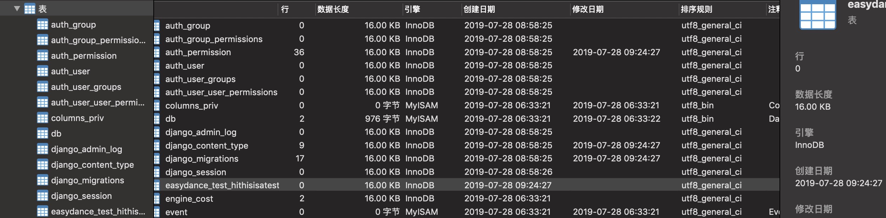

# Let's do something cool~

## pylint配置

```bash
conda install -c conda-forge pylint-django # conda环境输入
```

```json
 "python.linting.pylintArgs": [ "--load-plugins", "pylint_django" ],  //vscode里的settings.json的默认配置
```

## 数据库相关
  
> 以下是我今早(2019.7.28)折腾了很久得出的经验。。

### easydance_puppet/settings.py文件

这个文件中的两个配置项比较关键，

#### **INSTALLED_APPS**字段

 每当我们用以下指令

```bash
django-admin startapp [appname]
```

新建一个 接口文件 时， 我们需要在installed_app 注册同名方法。

#### **DATABASES**字段

这是我们本地mysql数据库相关的设置的字段，注意如果你本地mysql数据库的默认密码不是 123 的话，记得更改配置哦～

### __pycache__ 与 migrations目录

1. __pycache__ 目录为缓存目录，所以我们的**提交**应忽略他的改动，这里我已经在.gitignore文件里写了配置啦～

2. migrations目录

你们看一下项目里的每个app(除了easydance_puppy目录的每个目录)，都有一个文件叫 **models.py**

django为我们提供了一个非常方便的操作

 通过在models.py里配置好表结构，可以在mysql数据库里生成对应的表（Tables）：

* 通过以下语句可以生成某一次迁移所需要的迁移文件

   ```bash
   python manage.py makemigrations
   ```

   如果顺利，会生成一个0001.initial.py文件。
  
* 执行以下语句开始迁移

  ```bash
  python manage.py migrate
  ```

迁移完毕后，咱可以去数据库查看对应的表

比如说我在easydance_test 的 models.py定义了一个表名如下：

```python
class HiThisIsATest(models.Model):
    when = models.CharField(max_length = 20)
```

执行以下两条命令

```bash
python manage.py makemigrations
python manage.py migrate
```

可以在图形化工具中看到以下结果


